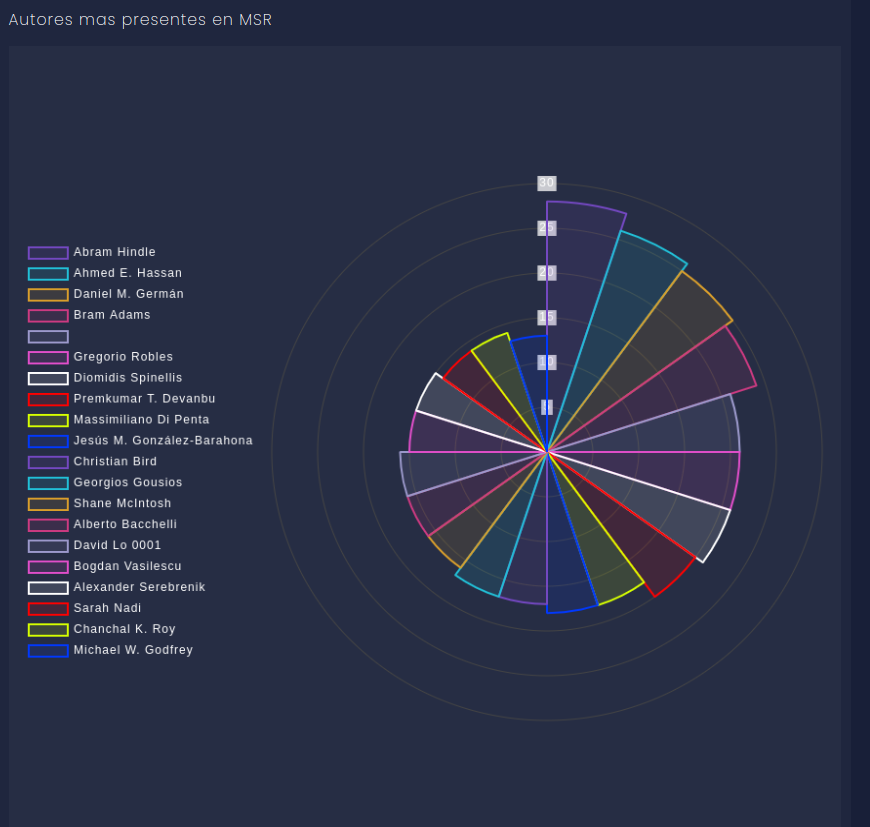
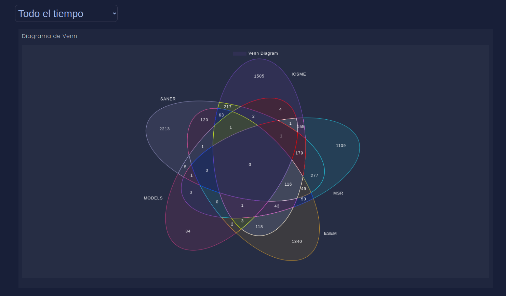

Modo de uso: 
Se descarga el archivo dblp.xml.gz y dblp.dtd en el mismo directorio desde la URL: https://dblp.org/xml/
(Puedes descargarlo a mano o con el comando wget, para ello tienes que instalar wget:apt-get install wget
y mas tarde desgargar los archivos con el comando: 
    wget https://dblp.org/xml/dblp.dtd
    wget https://dblp.org/xml/dblp.xml.gz
)

Se descomprime el archivo en el directorio: gzip -d dblp.xml.gz

1º Para exportar el XML a db se debe de ejecutar el siguiente comando:

python3 main_dblp_parser.py --dblp dblp.xml --output DBLP.db

Este proceso tarda alrededor de 5-6 minutos, se exportan las siguientes columnas con sus
formatos:

    genre 
    title 
    author 
    year 
    booktitle 
    ee 
    crossref 
    url

Pudiéndose visualizar en la siguiente url:
    https://inloop.github.io/sqlite-viewer/

2º Una vez que se obtiene la salida como base de datos, ya se puede operar y extaer los
datos en un json.

Dicho json tiene como formato:

{
    booktitle: [
        registro
    ]
    booktitle2:[
        registro
    ]
    .
    .
    .
} 

Para obtener dicho json se debe crear una lista con los "booktitle" que quieras extraer y 
ejecutar el comando: 

python3 extraccion_datos_concretos.py

Te devuelve un JSON en el cual se guardan diccionarios por cada Bookmark.

Aquí es cuando se ejecuta un servidor json:

el cual se instala y ejecuta de la siguiente manera: https://github.com/typicode/json-server

    1º Se instala node.js
        sudo apt install nodejs
    2º Se instala la librería npm.
        sudo apt install npm
    3º Se instala el json-server
        sudo npm install -g json-server@0.16.3
    4º Se ejecuta el json-server --watch json.js (--port port)

Con esto tenemos un servidor json para lanzar la API.

El servidor en el que contenemos la API se lanza de la siguiente manera:

	json-server --watch out.json --port 4400

Cuyo resultado nos devuelve:

    \{^_^}/ hi!

    Loading out.json
    Done

    Resources
    http://localhost:4400/ICSME
    http://localhost:4400/MSR
    http://localhost:4400/FSKD
    http://localhost:4400/GECCO
    http://localhost:4400/SDM

    Home
    http://localhost:4400

Lo siguiente es abrir el archivo /web/index.html, en dicha web se puede observar 3 gráficos:

1º Autores que más aparecen en el primer Bookmark configurado.

2º Autores que más aparecen en el segundo Bookmark configurado.

3º Autores que más aparecen coincidentes en ambos.

